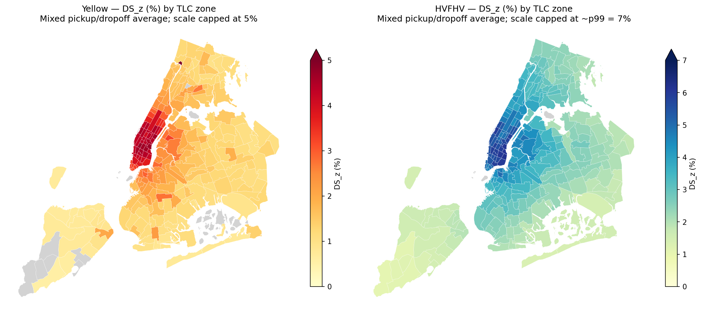

# Who Bears the Congestion Price?

**Executive summary — the burden of NYC's CBD congestion fee and its relationship with taxi and Uber/Lyft trip volume.**

## Background

On **January 5, 2025**, New York City implemented the
[first congestion-pricing program in the United States](https://apnews.com/article/5a8a6de4495d687079290918f5a499c2),
charging vehicles that enter a defined zone — the Manhattan Central Business District south of 60th
Street (the "Congestion Relief Zone," or CRZ). The fee depends on the vehicle: during peak hours, a
private passenger vehicle with E-ZPass pays **$9, generally once per day**, each covered **taxi** ride
pays **$0.75**, and each covered **Uber/Lyft** ride pays **$1.50**. Manhattan traffic was
[reported to be lighter afterward](https://apnews.com/article/cbd1d520ccbfbeb68d248e9d2ed3bd62). Given the fee structure,
private cars are the policy's main target, while taxis and Uber/Lyft face smaller per-trip charges.

## Research questions

We instead study the much smaller per-trip charge on **taxi and Uber/Lyft**, and ask two linked
questions:

1. **Who bears it?** Even though the fee is small and mostly flat, is it felt evenly across riders?
2. **Did it reduce trips?** Did taxi/Uber-Lyft volume fall after the fee, and fall more where a zone
   was more exposed to the CRZ?

## Data

We use public [NYC TLC trip records](https://www.nyc.gov/site/tlc/about/tlc-trip-record-data.page) —
roughly 37M Yellow Taxi and 202M Uber/Lyft trips across the study windows. Each record contains
trip geography (pickup/dropoff zone and distance) and service-specific financial fields. Yellow
reports metered totals and tips; HVFHV passenger cost is reconstructed from public TLC components
and may not equal the rider's final app payment. We compare **February–June 2024** (before) against
the **same months of 2025** (after) to reduce seasonal mismatch; January 2025 is excluded as a
transition month.

The unit of analysis is **zone × direction** — each TLC zone is scored separately on its pickup side
and its dropoff side, because a zone can behave very differently depending on whether trips start or
end there. Yellow and Uber/Lyft are analyzed separately in the primary within-service analyses:
their cost fields are constructed differently, and Yellow has a Flex-fare regime shift that affects
its raw volume. Model 3 then compares aligned Yellow and Uber/Lyft panels within the same zones.

## What we measure

- **Burden — the Zone Disruption Score, `DS_z`.** For each charged trip, the CBD fee as a share of
  what the trip would otherwise have cost; aggregated to zone × direction. A higher `DS_z` means the
  fee is a bigger slice of the fare. It measures the relative fee burden.
- **Outcome — trip-volume change**, 2024 → 2025, per zone-side.

## Finding 1 — Burden: strong, stable, and uneven

A fixed fee is a big slice of a cheap short trip and a tiny slice of a long airport trip, so relative
burden is highest for shorter, lower-cost trips. The highest-burden zone-sides are the dense
Manhattan core for both services (top `DS_z` ≈ 4.6–4.8% for Yellow, ≈ 6% for Uber/Lyft);
airport trips carry far less (≈ 1–2% vs ≈ 4–5% for non-airport trips).

Crucially, the **ranking is stable** across denominator-floor choices ($0.50–$5): Spearman ≥
0.996 for Yellow and 1.00 for Uber/Lyft, with 100% top-10/20 overlap. So `DS_z` is a
**reusable, reproducible burden metric that gives a dependable ranking**, not an artifact of one
reasonable floor choice.

*Fee burden (`DS_z`) by TLC zone — Yellow Taxi (left) and Uber/Lyft (right, labeled "HVFHV"). Both
concentrate in the dense Manhattan core. Each service is shown on its own scale — `DS_z` is comparable
within a service, not directly across them.*

## Finding 2 — Volume: negative signals, but not a clear causal effect

For the volume question we build a **modeling ladder** using three regression designs, each with its
own controls and assumptions. Each design tightens part of the previous comparison, and Models 2 and
3 are also checked against a *no-fee* placebo window:

- **Model 1 (higher-burden zones vs. lower-burden zones, cross-zone association).** Higher-burden zones grew less — strong for Uber/Lyft
  (r ≈ −0.61), weak for Yellow (r ≈ −0.17) — but high burden ≈ dense core ≈ short trips, so it
  is confounded with geography.
- **Model 2 (higher-exposure zones vs. lower-exposure zones, exposure difference-in-differences).** Main equal-weighted estimates are
  approximately −11% for both services, but both also show negative estimates in the no-fee
  2023→2024 placebo window. Yellow is additionally sensitive to volume weighting and the
  within-Manhattan comparison.
- **Model 3 (Uber/Lyft vs. Yellow Taxi, cross-vehicle DiD, same zones).** Uber/Lyft fell ≈ 5.9% more than Yellow inside the
  CRZ — but the no-fee placebo is large and opposite-signed, and Uber (−11.4%) and Lyft
  (+10.3%) move in opposite directions despite facing the same $1.50 fee.

Every design finds a negative main signal, but the diagnostics limit how each estimate can be read.
We therefore report the volume evidence as an **association, not a causal effect**. This is
**inference, not prediction**: the bottleneck is *identification* — whether the comparison group
represents what would have happened without the fee — not model flexibility, so more complex models
would not resolve it.

## What this adds

- **A sharper question** — we isolate the **taxi/Uber-Lyft layer** (who pays the small per-trip
  charge), distinct from the private-car traffic story.
- **A reusable, stable metric** — `DS_z`, reproducible from public TLC data, with a ranking that is
  stable across the tested denominator floors.
- **An honest boundary** — placebo tests show that similar exposure-related patterns were already
  present before the fee, so we mark clearly where public trip data can and cannot support a causal
  claim.

## Main limitations

- TLC data show only completed trips — not mode-switching, cancellations, or trips that were not taken.
- High-burden zones are not random — they are the dense Manhattan core, tied to short trips and low base cost.
- The volume designs are weakened by no-fee placebo checks.
- Yellow's Flex Fare regime shift affects raw Yellow volume; HVFHV cost is reconstructed from public fields and may miss app-side pricing.

## Future directions

Three extensions, each targeting a limitation above:

- **Sharpen the comparison** — longer pre-policy panels, more placebo windows, and boundary or
  matched-zone checks, for a more credible counterfactual.
- **Look beyond TLC trips** — transit, bike, vehicle-entry, and traffic-speed data, to distinguish
  mode substitution from trips that were not taken.
- **Separate fee effects from platform dynamics** — provider-specific (Uber vs Lyft) baselines and
  rider-neighborhood context, so the fee response is not confounded with Uber/Lyft market shifts.

Each would improve interpretation, but each needs its own design.

---
